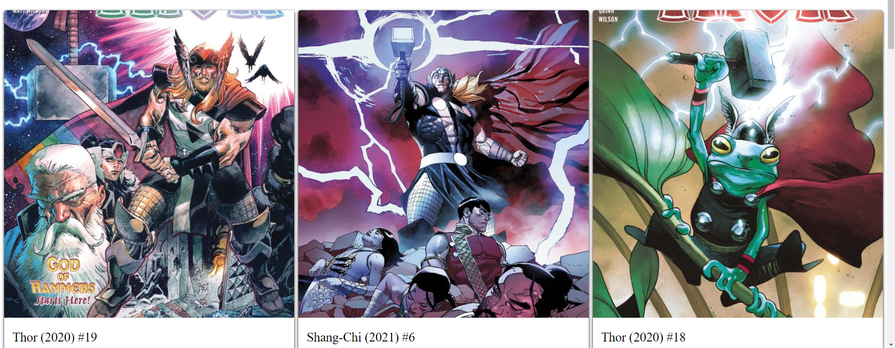

# **API to display marvel characters and its related comics**

## This application will be used to fetch data from the marvel api. It will take user input and return the given character and comics that the character is in.

# Empty State

# Search for a character

# Comics for the character

# Character is not found

